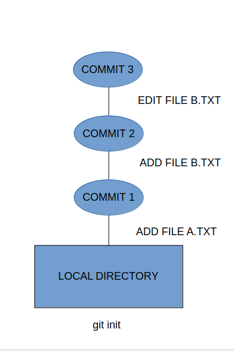
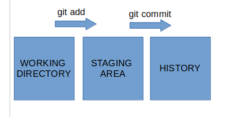

##                                  Introduction to GIT


Git is a type of version control system(VCS). A VCS enables you to record changes to files over time.

The main features of GIT are :

1. Take snapshots of flies over time.
2. Restore the earlier versions of flies from snapshots.
3. Work on multiple versions of a file in parallel.

#### Git commit graph:



Git tracks changes to files over time through commits. Commits are snapshots of different versions of the file. Every commit is logged by git. git will log who made changes and when. Usually,we make a commit when a logical unit of work is done. A commit saves the state of the files at a particular point of time.

#### Conceptual area diagram:



Working tree is what we see in our file system.

The history is kept in a hidden directory - .**git**.  The .git directory holds an object database and metadata that makes up our repository.

The staging area is also known as the **index.**

#### Start a local repository:

It is done using **git init** command.

```
$ mkdir gitdemo
$ cd gitdemo
$ vi A.txt
```

In the above lines of code , i created a local directory named gitdemo. Then i created a file named A.txt in it. The contents of the file are:

```
$ cat A.txt
This the the content of file A
```

Then i make this directory hold a git project using the git init command. The output which i get after running this command is:

```
$ git init
Initialized empty Git repository in /home/aryama/gitdemo/.git/
```

 With this command ,git adds a new hidden sub directory .git in gitdemo directory.

```
$ la
A.txt .git
```

#### Configure Git username and email:

The commit has our name , email , a timestamp and our commit message. This is important to track when and by whom the changes where made. We use **git config --global user.name**  and **git config --global user.email**  to configure the name and email globally for any git repository on our system. We can use --local instead of --global to configure username and email for a particular local repository. 

git config list shows us that our name and email are set.

```
$ git config --global user.name "aryamasinha"
$ git config --global user.email "aryamasinha864@gmail.com"
$ git config --list
user.email=aryamasinha864@gmail.com
user.name=aryamasinha
core.repositoryformatversion=0
core.filemode=true
core.bare=false
core.logallrefupdates=true
```

#### Making a git commit:

We have a file A.txt in the working tree. It is untracked right now(it is not in the staging area).To check whether a file tracked or untracked , we run the git status command. git status command tells us how things stand in our working tree and in our staging area.

```
$ git status
On branch master

No commits yet

Untracked files:
  (use "git add <file>..." to include in what will be committed)

	A.txt

nothing added to commit but untracked files present (use "git add" to track)
```

We stage the file A.txt with the git add command.

```
$ git add A.txt
$ git status
On branch master

No commits yet

Changes to be committed:
  (use "git rm --cached <file>..." to unstage)

	new file:   A.txt
```

Now the file A is in the staging area, ready to be committed. Now git is tracking A.txt. Now we make our first commit using the git commit command.

```
$ git commit -m "First commit"
[master (root-commit) 25d3fe1] First commit
 1 file changed, 1 insertion(+)
 create mode 100644 A.txt
```

The -m allows us to add commit message along with the command. When you leave off the -m option from the commit command, it takes you to your default file editor where you can write multi-line commit messages.

Now we'll run the git status command again

```
 $ git status
On branch master
nothing to commit, working tree clean
```

Nothing to commit means everything in our staging area is already committed. We also see a part of a hash. git performs a **SHA-1** hash of every commit that's made. It takes in the directories ,files and some metadata to create this hash. Every commit we make has a unique hash value. In the commit output above ,we see the first 7 hexadecimal characters of a 40 character hash.

#### Checking the details of the commit graph.

This is done by the **git log** command. 

```
$ git log
commit 25d3fe111e7eefeada33be03013c1055f839d5aa (HEAD -> master)
Author: aryamasinha <aryamasinha864@gmail.com>
Date:   Tue Sep 10 20:55:20 2019 +0530

    First commit
```

 Now we see the full 40 characters log hash. If we add the -p option to git log , we can see what actually changed with each commit. With git log --"filename" , we can see the commits log in which the file is committed. 

Now lets add another file B.txt and view its content

```
$ vi B.txt
$ cat B.txt
This the the content of file B
```

Now this file is untracked. If we run git status will be:

```
$ git status
On branch master
Untracked files:
  (use "git add <file>..." to include in what will be committed)

	B.txt

nothing added to commit but untracked files present (use "git add" to track)
```

Now we add the file B to the staging area. We can do it by using git add B.txt , but we'll use git add . instead. The dot adds all the files on the working tree to the staging area.

```
$ git add .
```

We run **git diff** to check difference between the files in the working tree and the staging area. If we run **git diff --staged** , it will show us the difference between our staging area and our most recent commit.

```
$ git diff --staged
diff --git a/B.txt b/B.txt
new file mode 100644
index 0000000..5d201e7
--- /dev/null
+++ b/B.txt
@@ -0,0 +1 @@
+This the the content of file B
```

Now lets make our 2nd commit with B.txt file

```
$ git commit -m "add B.txt"
[master 4c206d5] add B.txt
 1 file changed, 1 insertion(+)
 create mode 100644 B.txt
```

We get a unique hash for this commit.

#### Remove a file in Git:

```
$ git rm B.txt
rm 'B.txt'
```

This command did two things at once. It removed the file B from the working tree and also staged this removal. Now we commit again

```
$ git status
On branch master
Changes to be committed:
  (use "git reset HEAD <file>..." to unstage)

	deleted:    B.txt
$ git commit -m "delete B.txt"
[master 16548c9] delete B.txt
 1 file changed, 1 deletion(-)
 delete mode 100644 B.txt
```

#### Undo a working tree change:

Now let's modify A.txt. 

```
$ vi A.txt
$ cat A.txt
This the the content of file A
Modified file A
```

With the git checkout command, we can replace the new A.txt in the working tree, with the previous version of A.txt that is still in the staging area. Effectively we will be discarding the new working tree changes.

```
$ git checkout -- A.txt
$ cat A.txt
This the the content of file A
$ git diff
$
```

The file A is changed back to its previous form that is how it is in the staging area. git diff shows no output because there is no difference between the working tree and the staging area.

#### Undo staging of files:

We do that with the git reset command. This restores the file/s from the latest commit.

Now lets modify the contents of file A once again and add it to the staging area.

```
$ vi A.txt 
$ cat A.txt 
This the the content of file A
Modified file A once again
$ git add A.txt
$ git status
On branch master
Changes to be committed:
  (use "git reset HEAD <file>..." to unstage)

	modified:   A.txt
```

Now , we can unstage this file and restore it from the latest commit by using git reset command.

```
$ git reset HEAD A.txt
Unstaged changes after reset:
M	A.txt
$ git checkout -- A.txt
$ cat A.txt
This the the content of file A
```

#### Restore from an earlier commit:

#### We deleted B.txt from our working tree as well as the staging area. But a version of it is present in the 2nd commit. We can bring it back from commit before it was deleted.

```
$ git log -- B.txt
commit 16548c9092e82d71ae4123b1723423dfaa12905f (HEAD -> master)
Author: aryamasinha <aryamasinha864@gmail.com>
Date:   Tue Sep 10 21:47:07 2019 +0530

    delete B.txt

commit 4c206d51c60c758ea711430b5663d1d2104d06ee
Author: aryamasinha <aryamasinha864@gmail.com>
Date:   Tue Sep 10 21:37:26 2019 +0530

    add B.txt
$ git checkout 4c206 -- B.txt
$ git status 
On branch master
Changes to be committed:
  (use "git reset HEAD <file>..." to unstage)

	new file:   B.txt
$ git commit -m "brought back B.txt"
[master 0ae2397] brought back B.txt
 1 file changed, 1 insertion(+)
 create mode 100644 B.txt
$ls
A.txt B.txt
```

 We do this with the git checkout command along with the first 5 characters of the SHA-1 hash value. This brings our file B.txt back to the working and staging area. Now we commit this change.

#### .gitignore

We sometimes have files such as log files which we do not want to be tracked. We store such files in a .gitignore file.

```
$ touch demo1.log
$ mkdir logs
$ cd logs
$ touch demo2.log
$ cd .. 
$ git status
On branch master
Untracked files:
  (use "git add <file>..." to include in what will be committed)

	demo1.log
	logs/
	
nothing added to commit but untracked files present (use "git add" to track)
$ vi .gitignore
$ cat .gitignore
demo1.log
/logs
$ git status
On branch master
Untracked files:
  (use "git add <file>..." to include in what will be committed)

	.gitignore

nothing added to commit but untracked files present (use "git add" to track)
$ git add .
$ git commit -m "added .gitignore file"
[master 5ee8ee1] added .gitignore file
 1 file changed, 3 insertions(+)
 create mode 100644 .gitignore
```

#### REST TOPICS TO BE UPDATED TOMORROW :)


